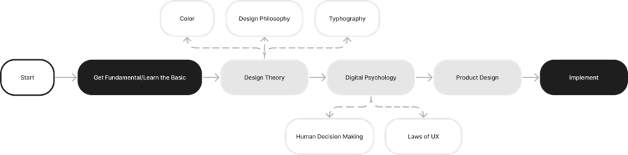

# 🚀 Fundamental UI/UX Learning Hub

  
    
  <em>Ikuti alur ini untuk menguasai dasar-dasar UI/UX dari nol hingga implementasi! 🌟</em>

## Selamat Datang! 👋

Halo, desainer masa depan! Repo ini adalah **pusat pembelajaran interaktif** untuk memahami **Fundamental UI/UX**. Kami fokus pada pendekatan **hands-on** yang menyenangkan, mulai dari teori dasar hingga praktik nyata. Apakah kamu pemula yang penasaran dengan desain digital? Atau ingin refresh skill untuk proyek berikutnya? Tempat yang tepat!

### Mengapa UI/UX Penting?
- **UI (User Interface)**: Membuat tampilan yang cantik dan intuitif – seperti memilih warna sempurna untuk tombol "Buy Now" yang bikin user langsung klik! 🎨
- **UX (User Experience)**: Memastikan perjalanan user lancar dan menyenangkan – dari riset hingga feedback, agar app-mu dicintai user. ❤️

| Aspek | UI Design | UX Design |
|-------|-----------|-----------|
| **Fokus** | Visual & Interaksi | Pengalaman Keseluruhan |
| **Tools Umum** | Figma, Adobe XD | User Research, Wireframing |
| **Contoh** | Layout halaman login | Alur checkout yang seamless |
| **Tujuan** | Estetika + Fungsi | Kepuasan + Retensi User |

**Tujuan Repo Ini**: Bantu kamu belajar step-by-step, dengan materi ringan, contoh real-world (seperti Apple & Gojek), dan elemen fun seperti game sederhana. Semua dirancang **mobile-first** dan **accessible** – coba scroll di HP-mu! 📱

## 🗺️ Roadmap Pembelajaran
Ikuti flowchart di atas untuk progresmu. Mulai dari **Learn the Basics** (warna, tipografi, layout) hingga **Implementation** (prototype & testing).

🔍 Detail Roadmap (Klik untuk Expand)

1. **Get Started / Learn the Basic**  
   - Pahami warna, tipografi, & layout.  
   - Riset user dasar (persona & journey map).

2. **Design Theory**  
   - Sejarah UI/UX (dari 1990-an GUI hingga neumorphism 2020-an).  
   - Prinsip: Hierarchy, Consistency, Simplicity.

3. **Digital Psychology**  
   - Mengapa user klik tombol merah? (FOMO & Gestalt).  
   - Accessibility untuk semua user.

4. **Product Design**  
   - Buat wireframe & prototype.  
   - Tools: Figma, Uizard.

5. **Implementation**  
   - Testing usability & iterasi.  
   - Tren terkini: AI-driven design.

## 📁 Isi Repo Saat Ini
Repo ini terus berkembang. Berikut materi utama:

- **index.html** – Situs live demo! Lihat timeline sejarah UI/UX, penjelasan lengkap, & roadmap interaktif. [Kunjungi di sini](https://faruq1997.github.io/UIUX_Fundamental/). (Update terbaru: Efek hover & navigasi mobile.)
- **roadmap_uiux_fundamental.png** – Visualisasi alur belajar (sudah di-embed di atas!).
- **UIUX_Pertemuan_2.ipynb** – Jupyter Notebook untuk sesi 2: Eksplorasi elemen UI dasar dengan contoh kode Python (matplotlib untuk visualisasi layout).
- **template_lembar_kerja_UIUX.docx** – Template Word untuk latihan: Buat wireframe manualmu sendiri.

## 🚀 Mulai Belajarmu Sekarang
1. Clone repo: `git clone https://github.com/faruq1997/UIUX_Fundamental.git`
2. Buka [situs demo](https://faruq1997.github.io/UIUX_Fundamental/) untuk tour cepat.
3. Ikuti links eksternal: [Figma](https://www.figma.com), [Bootstrap Tutorial](https://www.w3schools.com/bootstrap5/index.php), [UX Challenges](https://www.uxtools.co/challenges).

## 🤝 Kontribusi
Mau tambah materi? Ide game baru? Atau fix bug di index.html?  
- Fork repo.  
- Buat branch: `git checkout -b feature/amazing-idea`.  
- Commit & push.  
- Buka Pull Request!  

Kami sambut kontribusi dari semua level. Gunakan template issue untuk feedback.

## 📄 Lisensi
Repo ini di bawah [MIT License](LICENSE) – bebas gunakan & bagikan, tapi beri kredit ya! 

**Terima kasih telah bergabung! Mari desain dunia yang lebih baik bareng. 💻✨**  
* Dibuat dengan ❤️ oleh [faruq1997](https://github.com/faruq1997)*  

---

> **Feedback?** Star repo ini atau buka issue. Update selanjutnya: Lebih banyak quiz & video shorts!
